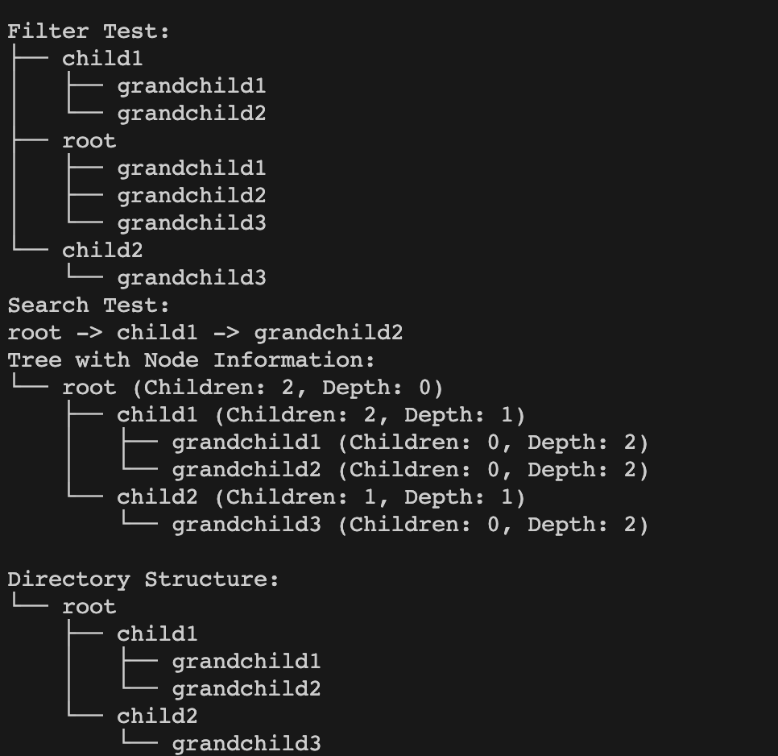

<h1 align="center"> dir tree </h1>


dir tree is a Python package designed to visualise  hierarchical structures such as directory trees or JSON files. It provides functionalities to visualize the structure as a tree, search for specific nodes, and filter nodes based on custom criteria. 

## Screenshots



## Features

| Function                | Description                                                                                     |
|-------------------------|-------------------------------------------------------------------------------------------------|
| `format_tree_info(structure)`      | Formats a tree with detailed information about each node's children and depth.                  |
| `search(structure, target)`                | Searches for a specific file/folder in the structure and returns its path.                      |
| `filter(structure, criteria)`                | Filters the tree based on a given criteria (Bool)function.|
| `format_tree(structure)`           | Formats and returns a basic representation of the tree structure.                               |
| `max_depth(structure)`             | Calculates and returns the maximum depth of the tree structure.                                 |
| `count_files(structure)`           | Counts and returns the total number of files within the structure.                              |
| `file_type_distribution(structure)`| Calculates the distribution of different file types within the structure.                       |
| `git_tree(g, repo_name)`              | Generates a dictionary of the repository structure.                                  |
| `get_info(structure)`              | Prints out basic info about directories  Maximum depth, Number of files, and File distribution                                |


# USAGE 

## Basic Usage 

### Input: Dictionary/JSON

```
from dir_tree import format_tree, search_node, filter_nodes

# Define your structure
structure = {
    "root": ["child1", "child2"],
    "child1": ["grandchild1", "grandchild2"],
    "child2": ["grandchild3"],
}

# Visualize the structure
print(format_tree(structure))

# Search for a node
print(search_node(structure, "target_node"))

# Filter nodes
filtered_structure = filter_nodes(structure, lambda node: "grandchild" in node)
print(format_tree("root", filtered_structure))
```

### Input: Using Github personal access tokens

```
from github import Github, Auth

from dir_tree import format_tree, search_node, filter_nodes


# Authentication and GitHub Initialization
token = ''
auth = Auth.Token(token)
g = Github(auth=auth)


# Visulise the repo
print(format_tree(git_tree(g, repo_name)))


# Search for a file and return the file path
print(search_node(git_tree(g, repo_name), "file_name"))
```


# Installation 
```
pip3 install dir_tree
```


# Where to Use
dir_tree is ideal for:

- Visualizing many git repos. 
- Building CLI tools that require tree-structure 
- Including gile structures in HTML. Since we return a string we can wrap the file structure with 
```<pre> </pre>``` to show in the html

# Contributing
Contributions to dir tree are welcome! Please follow these steps to contribute:

- Fork the repository.
- Create a new branch for your feature or fix.
- Commit your changes.
- Push to the branch.
- Submit a pull request.

Or otherwise please make an Issue!


# License
This project is licensed under the MIT License.


